[](https://github.com/ingeniouspartners)
### [Ingenious Partners](https://github.com/ingeniouspartners)

# [CableTrack PRO](https://app.cabletrack.pro)

[](https://app.cabletrack.pro)


## Table of Contents

* [Overview](#overview)
* [Milestones](#milestones)
    * [M1](#m1)
    * [M2](#m2)
    * [M3](#m3)
* [Deployment - DigitalOcean](https://app.cabletrack.pro)
* [Features](#features)
    * [Company Branding](#company-branding)
    * [Projects](#projects)
    * [Cables](#cables)
* [Entity Diagram](#entity-diagram)
* [User Guide](#user-guide)
    * [Landing Page](#landing-page)
    * [Sign Up](#sign-up)
    * [Sign In](#sign-in)
    * [Sign Out](#sign-out)
    * [Edit Profile](#edit-profile)
    * [List Company](#list-company)
    * [Add Company](#add-company)
    * [View Company](#view-company)
    * [Edit Company](#edit-company)
    * [List Project](#list-project)
    * [Add Project](#add-project)
    * [View Project](#view-project)
    * [Edit Project](#edit-project)
    * [List Cable](#list-cable)
    * [Add Cable](#add-cable)
    * [View Cable](#view-cable)
    * [Edit Cable](#edit-cable)
    * [List PullIn](#list-pullin)
    * [Add PullIn](#add-pullin)
    * [View PullIn](#view-pullin)
    * [Edit PullIn](#edit-pullin)
* [Community Feedback](#community-feedback)
* [Developer Guide](#developer-guide)

## Overview

CableTrack PRO is the premier tool to enable electricians to quickly and easily create cable schedules for their projects. It allows the tracking of the cable meta-data, pull-ins, terminations, and tests. All of this is designed to allow the
electricians to quickly and easily create the Building Information Management (BIM) reports and exports for their projects.

## Milestones

CableTrack PRO development is managed via Milestone projects and the issues they contain.

### [M1](https://github.com/orgs/ingeniouspartners/projects/1)

In Milestone 1, we concentrated on laying out foundational functionality, primarily the components that will be used to create the pages.

### [M2](https://github.com/orgs/ingeniouspartners/projects/2)

In Milestone 2, we will be putting together the pages utilizing the components created during M1. This should lead to a second round of page development where we refactor code for re-usability.

### [M3](https://github.com/orgs/ingeniouspartners/projects/3)

In Milestone 3, we instrumented the code with tests and added documentation.

## User Guide

### Landing Page

The welcome screen that allows the visitor to see what the application is about and give them the opportunity to sign-up or sign-in.


[//]: # (### Home Signed In)

[//]: # ()
[//]: # (The home page of a user. It provides information about user's profile, company and associated projects.)

[//]: # ()
[//]: # (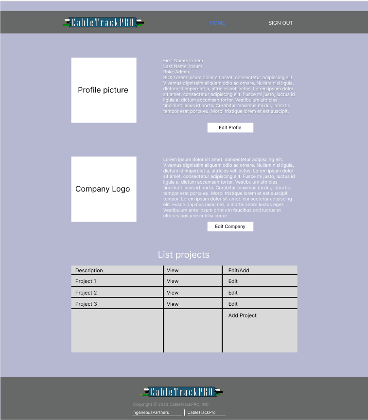)

### Sign Up

Ask the user for basic information, such as their email address (usernane) and desired password.

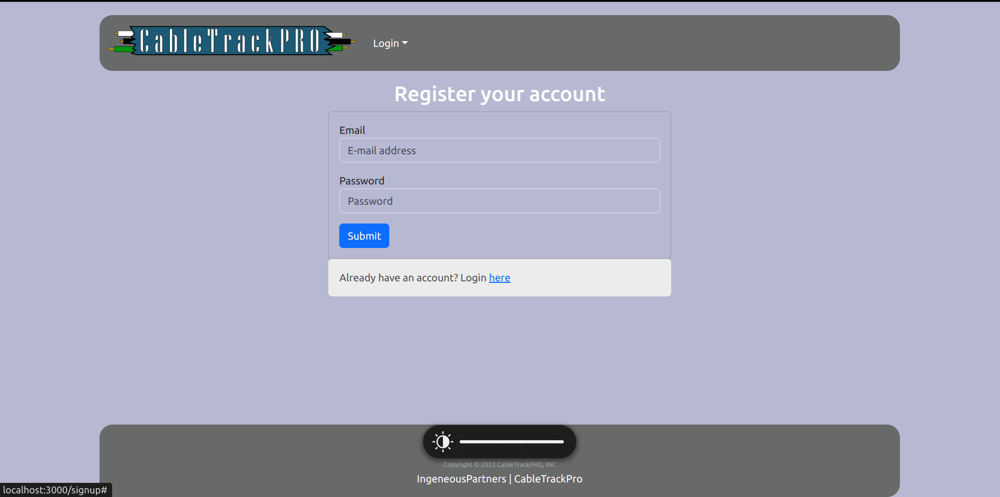

### Sign In

Ask the user for their email address (username) and password.

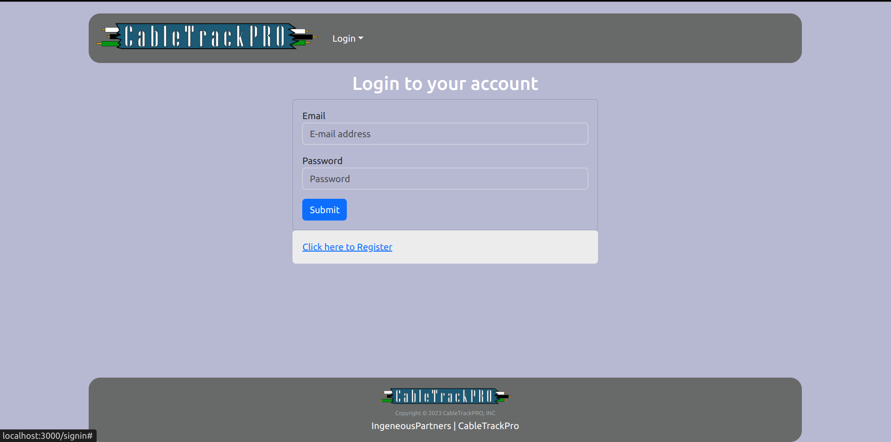

### Sign Out

Signs the user out of the application and redirects them to the Home page.

[//]: # (### Edit Profile)

[//]: # ()
[//]: # (Allows the user to update their profile information, such as First and Last Name, Photo URL.)

[//]: # ()
[//]: # (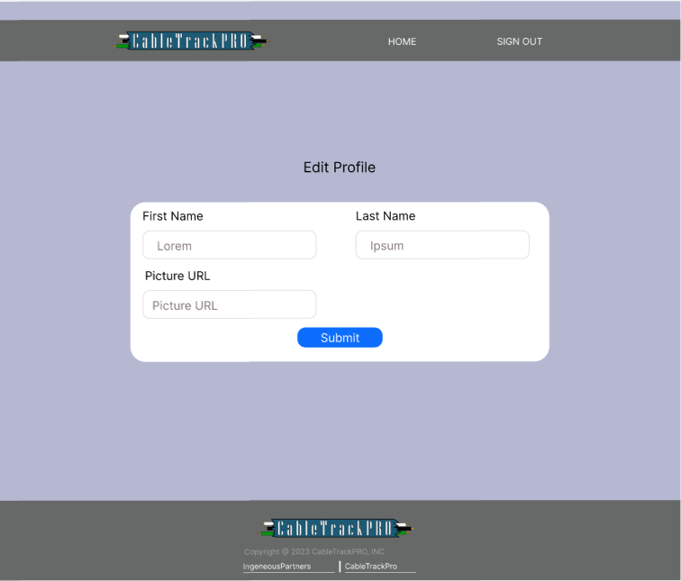)

### Add/Edit Company

Add or Edit the Company. This would include fields for Company Name, Logo URL, Address, City, State, ZIP, Country, and associated Users. If the Company ID is not provided, a new instance is created with a template model, otherwise the model is filled from the Company collection using <code>findOne()</code>.

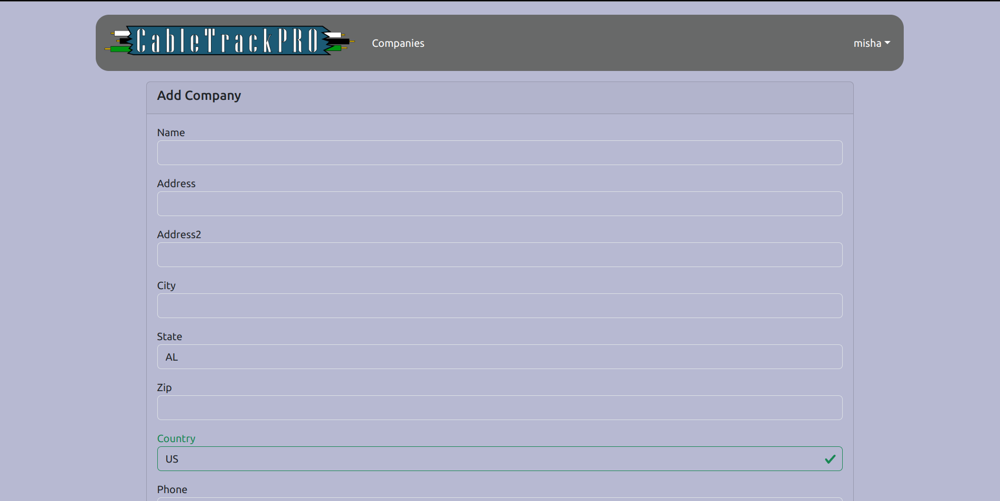

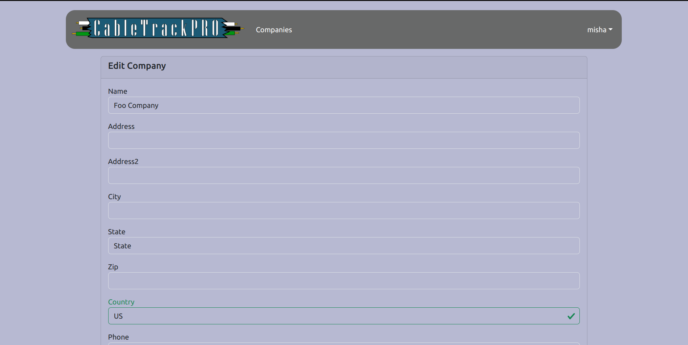

### List Company

Lists companies associated with the user. It provides links to add or edit a company.

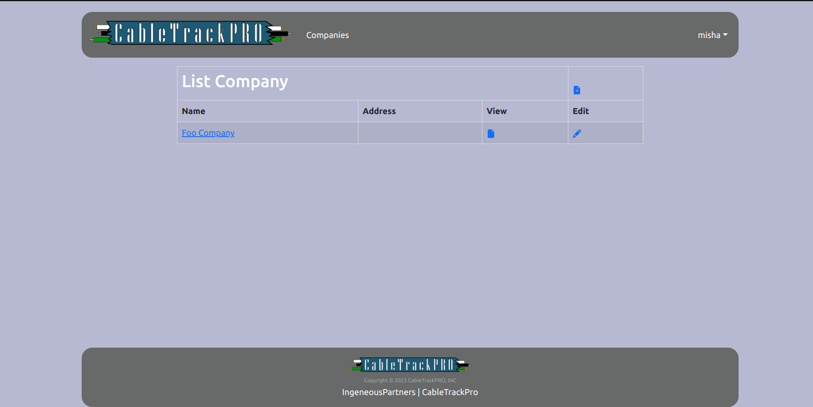

### View Company

View of a specific company with a detailed description about it.

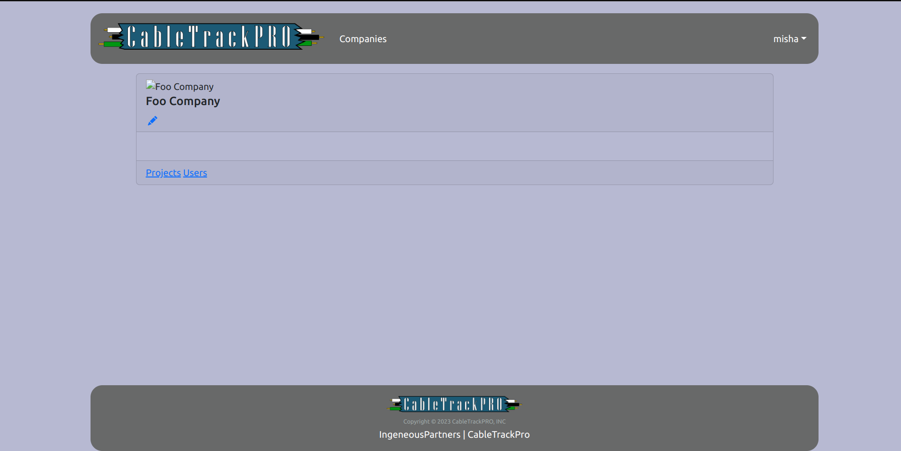

### List users associated with a company

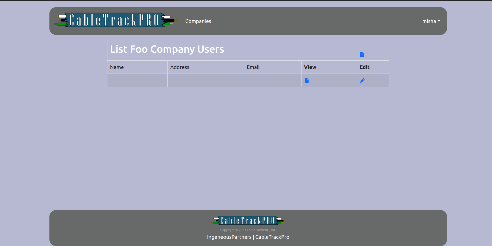

### List projects

A table of projects associated with a company

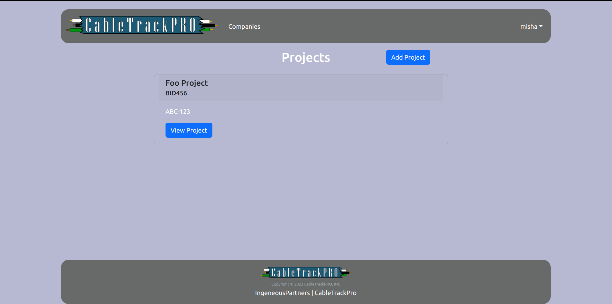

### Project view

The view of a project. It provides information about a project in a form of a table.

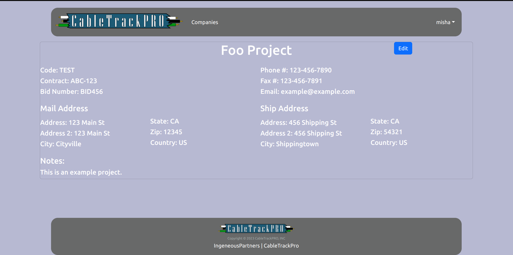

### Add/Edit Project

Add or Edit the Project. This would include fields for Project Code, Name, associated Users. If the Project ID is not provided, a new instance is created with a template model, otherwise the model is filled filled out from the Project collection using <code>findOne()</code>.

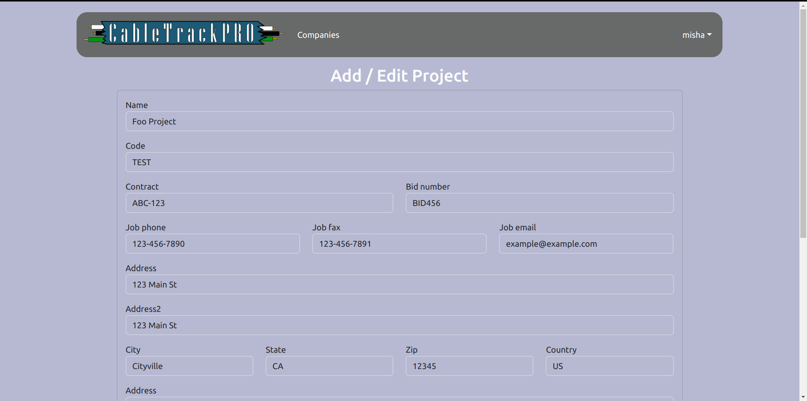

[//]: # (### Add/Edit Cable)

[//]: # ()
[//]: # (Add or Edit the Cable. This would include fields for Cable Code, Name, Type, Phase Code, etc. If the Cable ID is not provided, a new instance is created with a template model, otherwise the model is fille out from the Cable collection using <code>findOne&#40;&#41;</code>.)

[//]: # ()
[//]: # (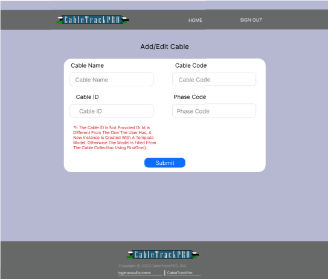)

## Community Feedback

[//]: # (### Feedback 1)

[//]: # ()
[//]: # (Feedback 1)

[//]: # ()
[//]: # ()

[//]: # (### Feedback 2)

[//]: # ()
[//]: # (Feedback 2)

[//]: # ()
[//]: # ()

## Developer Guide

### Downloading

First, [install Meteor](https://www.meteor.com/install).

Second, go to [CableTrack PRO Repository](https://github.com/ingeniouspartners/cabletrack.pro), and click the "Code" button. Select the "Download ZIP" option at the bottom of the menu.

### Installing

Third, go to your newly created repository, and click the "Clone or download" button to download your new GitHub repo to your local file system.  Using [GitHub Desktop](https://desktop.github.com/) is a great choice if you use MacOS or Windows.

Fourth, cd into the app/ directory of your local copy of the repo, and install third party libraries with:

```
$ meteor npm install
```

## Running the system

Once the libraries are installed, you can run the application by invoking the "start" script in the [package.json file](https://github.com/ics-software-engineering/meteor-application-template-react/blob/master/app/package.json):

```
$ meteor npm run start
```

The first time you run the app, it will create some default users and data. Here is the output:

```
 meteor npm run start 

> meteor-application-template-react@ start /Users/carletonmoore/GitHub/ICS314/meteor-application-template-react/app
> meteor --no-release-check --exclude-archs web.browser.legacy,web.cordova --settings ../config/settings.development.json

[[[[[ ~/GitHub/ICS314/meteor-application-template-react/app ]]]]]

=> Started proxy.                             
=> Started HMR server.                        
=> Started MongoDB.                           
I20220529-12:09:18.384(-10)? Creating the default user(s)
I20220529-12:09:18.389(-10)?   Creating user admin@foo.com.
I20220529-12:09:18.453(-10)?   Creating user john@foo.com.
I20220529-12:09:18.515(-10)? Creating default data.
I20220529-12:09:18.515(-10)?   Adding: Basket (john@foo.com)
I20220529-12:09:18.599(-10)?   Adding: Bicycle (john@foo.com)
I20220529-12:09:18.600(-10)?   Adding: Banana (admin@foo.com)
I20220529-12:09:18.601(-10)?   Adding: Boogie Board (admin@foo.com)
I20220529-12:09:18.773(-10)? Monti APM: completed instrumenting the app
=> Started your app.

=> App running at: http://localhost:3000/
```

Periodically, you might see `Error starting Mongo (2 tries left): Cannot run replSetReconfig because the node is currently updating its configuration` after the `=> Started HMR server.`. It doesn't seem to be a problem since the MongoDB does start.

### Viewing the running app

If all goes well, the template application will appear at [http://localhost:3000](http://localhost:3000).  You can login using the credentials in [settings.development.json](https://github.com/ics-software-engineering/meteor-application-template-react/blob/main/config/settings.development.json), or else register a new account.

